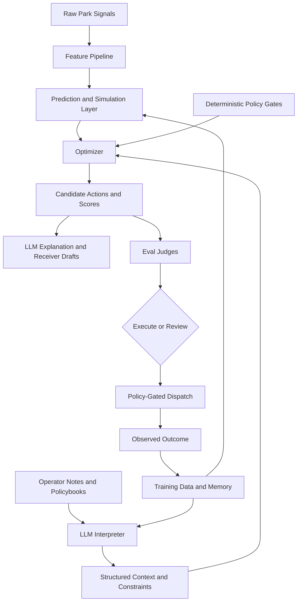

# ParkPulse ML-First Product Architecture

## Product Position

ParkPulse is not an LLM park controller.

ParkPulse uses prediction, simulation, optimization, and deterministic policy gates to operate the park. LLMs make that operating layer usable: they interpret messy notes, retrieve policy and case context, explain decisions, draft receiver payloads, and turn outcomes into training labels.

The clean product claim is:

> ParkPulse predicts operational pressure and optimizes bounded interventions, while LLMs convert messy human context, policybooks, and outcome traces into structured constraints, explanations, and training signals.

## Responsibility Split

| Job | Owner |
| --- | --- |
| Queue, food, density, staff, weather, and take-rate prediction | ML models, simulation, rules |
| Candidate action scoring | Optimizer and calibrated scoring models |
| Safety, labor, privacy, accessibility, and maintenance blocking | Deterministic policy gates |
| Messy operator note interpretation | LLM reasoning layer |
| Policybook and case interpretation | Retrieval plus LLM summarization |
| Guest, worker, manager, signage, and equipment copy | LLM drafting behind policy gates |
| Outcome summaries and training labels | LLM-assisted, audit checked |

## Primary Loop

## MVP Product Surface

The main screen should show only the operating loop:

1. Raw signals and structured features.
2. Prediction, simulation, and action scoring.
3. Optimizer recommendation.
4. Deterministic policy gate.
5. LLM-generated explanation and receiver payloads.
6. Human approval when required.
7. Outcome, eval, memory, and training-label receipt.

Labs can still contain benchmark gauntlets, AutoDream, generated SOPs, broad analytics, and reliability dashboards, but those should not define the core product story.

## Current Implementation Mapping

| Product layer | Current modules |
| --- | --- |
| Signal and feature intake | `park_signal_intake.py`, `world_state_reconciliation.py`, `park_simulation.py` |
| Prediction and simulation | `dynamic_operational_twin.py`, `park_twin_engine.py`, `digital_twin_tools.py` |
| Optimization and action scoring | `park_optimizer.py`, `park_action_bridge.py` |
| Deterministic gates | `policy_engine.py`, `policy_loader.py`, `park_governance_runtime.py` |
| LLM reasoning and explanation | `park_gemini_agent.py`, `park_multi_agent.py`, `agent_role_skills.py` |
| Dispatch | `park_delivery.py`, `parkpulse_routes/delivery_routes.py` |
| Outcome and training memory | `park_outcome_loop.py`, `park_eval.py`, `mongo_memory.py`, `park_actual_training.py`, BigQuery ML |

## Next Product Hardening

1. Make the feature envelope explicit for every scenario run.
2. Replace heuristic scores with small calibrated predictors where possible.
3. Make optimizer inputs and rejected candidates visible in the receipt.
4. Store outcome rows as training data with policy-safe labels.
5. Keep LLM actions explain-and-draft only unless a deterministic gate authorizes dispatch.
