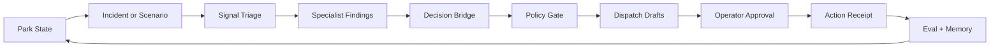

# ParkPulse MVP Architecture Extraction

## Essence

ParkPulse is an operations decision copilot for a live amusement park.

The product should answer one question better than a dashboard or chatbot:

> Something changed in the park. What should operations do now, and can we prove the recommendation is grounded, safe, and balanced?

Everything that does not help this loop is secondary.

## MVP Promise

An operator selects or receives an operational disruption. ParkPulse reads the current park state, explains the risk, proposes a bounded action plan, checks policy constraints, prepares dispatch payloads, and shows an evaluation/proof receipt.

The first MVP should prove four things:

1. The app understands a believable park state.
2. The agent chooses between tradeoffs instead of giving generic advice.
3. Safety, staffing, inventory, and guest-experience constraints can block or reshape the plan.
4. The final action is auditable: source signals, policy gate, dispatch payloads, and eval scores are visible.

## MVP User Journey

1. Operator opens the command center.
2. Operator chooses one of three scenarios: ride down, staff shortage, or food demand spike.
3. The app shows live park state and the immediate operational risk.
4. The agent run produces:
   - specialist findings
   - selected action plan
   - policy gate result
   - guest, worker, signage, or equipment payloads
   - eval scorecard
5. Operator approves or rejects the proposed dispatch.
6. The app records a decision receipt and shows what changed after the action.

## Core Loop



This loop should be the primary architecture, primary demo, and primary UI.

## Keep In The MVP Path

Backend modules that belong in the core path:

- `park_simulation.py`: live state and scenario effects
- `park_scenarios.py`: canonical scenario definitions
- `park_signal_intake.py`: unstructured signal classification and fusion
- `park_multi_agent.py`: specialist findings and orchestration
- `park_action_bridge.py`: action-plan shaping
- `policy_engine.py` and `policy_loader.py`: hard operational constraints
- `park_delivery.py`: dispatch payloads, approval, outbox
- `park_eval.py`: scorecard for the final recommendation
- `mongo_memory.py`: operational memory when configured, graceful local fallback otherwise
- `gcp_trace_eval.py`: trace/eval status and proof when configured

Frontend pieces that belong in the core path:

- `src/app/page.tsx`: command center route, but it should become a thin composition shell
- `src/hooks/useParkPulseState.ts`: state polling and normalization
- `src/lib/api.ts`: backend transport
- `src/lib/parkPulseDemoContent.ts`: canonical scenario content until backend fully owns scenarios
- `src/components/ParkPulseSignals.tsx`: live signal and command-stage display
- `src/components/ParkPulseActionBus.tsx`: dispatch and approval surface
- `src/components/ParkPulseMap.tsx`: spatial grounding
- `src/components/OperationalMemoryPanel.tsx`: proof/memory panel

## Move Out Of The MVP Path

These are useful, but they should not compete with the first demo route:

- AutoDream and learned maturity workflows
- full digital-twin benchmark gauntlets
- industrial dossier packet views
- BigQuery analytics expansion
- generated SOP workflows
- war-room remediation flows
- coverage engineer artifacts
- reliability QA agent UI
- multi-page executive/human/monitor surfaces beyond simple views

Keep them under a `labs`, `proofs`, or `advanced` namespace so the MVP command center stays understandable.

## Target Backend Shape

The current backend has a large route file. Split by product boundary, not by technology.

```text
backend/
  app/
    main.py
    api/
      state.py
      scenarios.py
      agent_runs.py
      actions.py
      approvals.py
      evals.py
      memory.py
      integrations.py
      labs.py
    core/
      park_state.py
      scenarios.py
      signal_triage.py
      orchestration.py
      decision_bridge.py
      policy.py
      delivery.py
      evaluation.py
      memory.py
    integrations/
      mongodb.py
      gcp_trace.py
      bigquery.py
      gemini.py
    labs/
      autodream.py
      digital_twin_benchmark.py
      industrial_dossiers.py
```

MVP routes should be few and stable:

- `GET /api/park/state`
- `GET /api/park/scenarios`
- `POST /api/park/scenarios/{scenario_key}/activate`
- `POST /api/park/agent-run`
- `POST /api/park/action`
- `POST /api/park/delivery/acknowledge`
- `GET /api/park/delivery/outbox`
- `GET /api/park/evals/{scenario_key}`
- `GET /api/park/memory`
- `GET /api/park/integration-status`

Everything else should be mounted under `/api/park/labs/*` until it is proven essential.

## Target Frontend Shape

The command center should be modular and boring. The current page file should be split into route composition, feature sections, and data hooks.

```text
frontend/src/
  app/
    page.tsx
    monitor/page.tsx
    human/page.tsx
    executive/page.tsx
  features/
    command-center/
      CommandCenter.tsx
      ScenarioRail.tsx
      ParkStateStrip.tsx
      SignalPanel.tsx
      AgentFindingsPanel.tsx
      DecisionPlanPanel.tsx
      PolicyGatePanel.tsx
      DispatchApprovalPanel.tsx
      EvalReceiptPanel.tsx
      useCommandCenter.ts
    map/
      ParkMap.tsx
    memory/
      MemoryProofPanel.tsx
  lib/
    api.ts
    scenario-contract.ts
  types/
    park.ts
    platform.ts
```

The first screen should contain only:

- scenario selector
- current park state strip
- incident/risk summary
- agent findings
- recommended action plan
- policy gate
- approval/dispatch payloads
- eval/proof receipt

## Product Cut

### MVP

- Three scenario buttons
- One command center page
- One agent run flow
- Human approval
- Delivery outbox
- Eval scorecard
- Memory/proof receipt
- Integration status

### Demo Plus

- streaming agent progress
- map replay
- proactive watch mode
- operator text command
- short post-action outcome comparison

### Labs

- benchmark gauntlet
- learned rerun
- AutoDream
- BigQuery priors
- industrial dossiers
- generated SOPs
- full reliability QA dashboard

## Definition Of Done For The MVP

The MVP is done when a judge can run one scenario and understand the whole system in under three minutes:

1. What changed?
2. Why is it risky?
3. What does the agent recommend?
4. What constraints shaped or blocked the action?
5. What exactly will be sent to guests/workers/signage/equipment?
6. Did a human approve it?
7. How was the decision scored?
8. Where is the receipt/memory?

If a panel does not answer one of those questions, remove it from the MVP route.

## Immediate Refactor Order

1. Create a `features/command-center` frontend folder and move visual sections out of `src/app/page.tsx`.
2. Define one `ScenarioRunReceipt` type shared by frontend panels and backend responses.
3. Add a small backend facade for the MVP routes and leave old routes as compatibility wrappers.
4. Move advanced backend routes behind `/api/park/labs/*`.
5. Make `src/app/page.tsx` render only the MVP command center.
6. Keep `/monitor`, `/human`, and `/executive` as secondary views that reuse the same run receipt.
7. Update docs and README so the repo describes the MVP loop first, integrations second.

