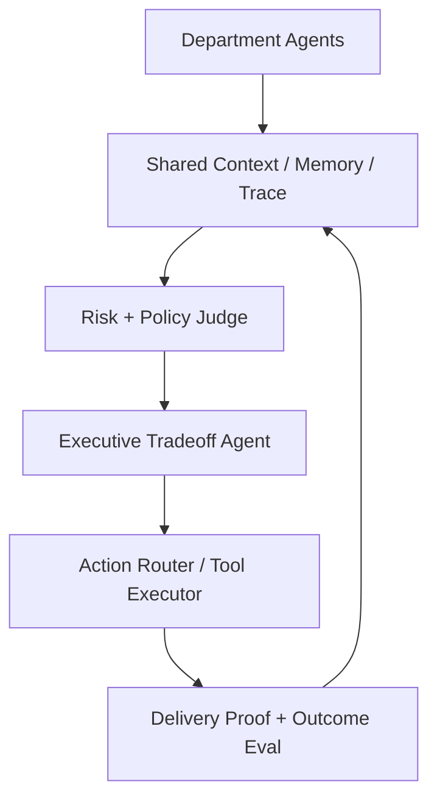
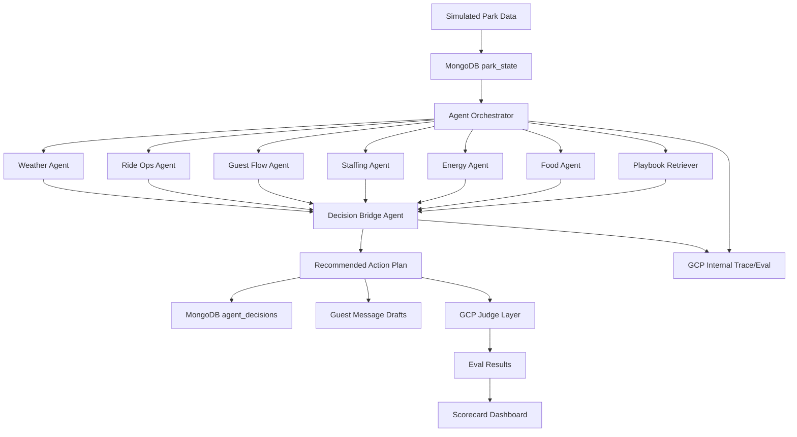

# ParkPulse Agent Architecture

ParkPulse AI is a multi-agent enterprise nervous system for amusement parks. The product is not operations-only: each department agent owns a narrow slice of the park, writes evidence into shared context, and negotiates tradeoffs under policy and eval before any action reaches a receiver.

## Department-Systematic Architecture



| Department | Canonical agent | Implementation agents | Main job |
| --- | --- | --- | --- |
| Operations | Ops Agent | `ride_ops_agent`, `guest_flow_agent`, `traffic_flow_agent`, `planning_agent` | Ride flow, queues, downtime, and staffing pressure. |
| Safety | Safety Agent | `safety_policy_agent` | Incident risk, ride reopening constraints, and crowd hazard. |
| Maintenance | Maintenance Agent | `facilities_energy_agent`, `memory_ops_agent` | Work orders, asset health, energy posture, and inspection history. |
| Guest Experience | Guest Agent | `guest_flow_agent`, `customer_support_agent` | Complaints, sentiment, notifications, routing, and recovery offers. |
| Food & Retail | Commerce Agent | `food_demand_agent` | Demand forecast, inventory, staffing, and promotions. |
| Finance | Finance Agent | `finance_agent` | Revenue impact, labor cost, refunds, and compensation decisions. |
| HR / Labor | Labor Agent | `staffing_agent` | Shift coverage, overtime, fatigue, and labor rules. |
| Marketing | Marketing Agent | `event_creative_agent` | Campaigns, event demand, offers, and guest segmentation. |
| Security | Security Agent | `safety_policy_agent`, `staffing_agent` | Crowd control, lost child, access control, and escalation. |
| Compliance | Compliance Agent | `safety_policy_agent`, `logic_audit_agent` | Privacy, safety regulation, and policy constraints. |
| Executive | Executive Agent | `decision_bridge_agent` | Cross-department tradeoff and final recommendation. |
| QA Judge | Eval Agent | `gcp_eval_judge_agent`, `logic_audit_agent`, `delivery_proof_agent` | Trace quality, tool use, delivery proof, and failure-mode review. |

Department agents can read widely, but write narrowly. Real receiver actions are performed only by `tool_executor_agent`.

| Department agent | Read tools | Write/action tools |
| --- | --- | --- |
| Operations Agent | ride status, queue length, park map, weather, event schedule | create ops alert, recommend route change, request staffing move |
| Safety Agent | incident reports, ride inspection status, crowd density, weather, policy book | safety alert, close/reopen recommendation, require human approval |
| Maintenance Agent | asset history, sensor health, inspection logs, spare parts inventory | create work order, assign technician, update repair status |
| Guest Experience Agent | guest complaints, app feedback, sentiment, notification history | draft guest message, issue recovery offer, create support ticket |
| Food & Retail Agent | POS sales, inventory, queue near shops, event schedule, weather | inventory alert, restock request, pause/launch promo |
| Finance Agent | ticket sales, refund data, labor cost, POS revenue, outage impact | revenue impact report, refund recommendation, budget alert |
| Labor / HR Agent | staff schedule, attendance, overtime, fatigue risk, skill matrix | shift adjustment recommendation, overtime warning, break reminder |
| Marketing Agent | campaign calendar, guest segments, demand forecast, weather/events | draft campaign, launch/pause promo, redirect offer |
| Security Agent | crowd density, incident reports, access logs, lost-child reports | dispatch alert, escalation request, zone control recommendation |
| Compliance Agent | policy books, privacy rules, safety rules, labor rules, audit logs | block action, require approval, generate compliance note |
| Executive Agent | all department summaries, risk scores, financial impact, guest impact | approve/reject action, set priority, choose tradeoff |
| QA / Eval Judge Agent | full trace, tool calls, outcomes, policy references | score decision, flag failure, create regression test |

Execution path:

```text
Department Agent -> proposes tool call
Compliance/Judge -> checks it
Executive Agent -> approves if needed
Tool Executor -> runs real action
Trace -> records outcome
```

Every department proposal is wrapped in this envelope before it can reach the executor:

```json
{
  "proposal_status": "proposed",
  "proposed_by": "guest_flow_agent",
  "department": "guest_experience",
  "requested_tool": "draft_guest_message",
  "requires_compliance": true,
  "requires_executive": true,
  "approval_status": "requires_executive",
  "executor_agent": "tool_executor_agent",
  "executor_status": "awaiting_executive"
}
```

Every department follows the same internal loop:

```text
Observe -> Interpret -> Predict -> Recommend -> Justify -> Trace
```

Tool access is department-scoped. A tool call must carry this contract:

```json
{
  "department": "food_retail",
  "tool": "adjust_inventory_alert",
  "intent": "prevent_stockout",
  "evidence": ["POS spike", "queue migration", "weather forecast"],
  "risk_level": "low",
  "policy_check": "passed",
  "expected_outcome": "avoid food shortage within 45 minutes",
  "rollback": "cancel alert if demand normalizes"
}
```

Example conflict:

| Agent | Proposal |
| --- | --- |
| Marketing Agent | Push a discount to the indoor food court. |
| Ops Agent | Indoor food court is already overcrowded. |
| Safety Agent | Do not increase traffic to Zone B. |
| Finance Agent | Discount may increase short-term revenue. |
| Executive Agent | Reject the Zone B promotion and redirect the offer to Zone C. |

This conflict is executable in the role-proposal layer with scenario key `marketing_promo_conflict`.

Boundary examples:

* Marketing Agent can read crowd data, but cannot change crowd routing.
* Ops Agent can recommend routing, but cannot send public guest messages directly.
* Guest Agent can draft guest messages, but high-risk messages require Compliance and Executive approval.

## Primary Loop



## Lifecycle Agent Groups

ParkPulse uses three versions of the agent group across the event lifecycle:

| Group | Purpose | Primary work | Output |
| --- | --- | --- | --- |
| Pre-event agent group | Simulate policy impact and reduce preventable risk before the event starts or before a disruption peaks. | Event planning, traffic-flow forecast, placement review, staffing/equipment pre-stage, safety and finance stress tests. | Policy impact simulation, prevention checklist, risk forecast, and pre-approved action candidates. |
| During-event agent group | Supervise live conditions and react safely when signals arrive. | Runtime signal reading, specialist disagreement resolution, policy gates, operator approval flags, and REST action dispatch. | Supervised action plan, guest/worker/equipment payloads, and live response telemetry. |
| Post-event agent group | Analyze what happened, learn, and improve the next plan. | Outcome scoring, trace/eval review, logic audit, memory writeback, and plan revision. | Eval scorecard, MongoDB learning rule, revised thresholds, and a new plan version. |

The same specialist roles can appear in more than one group, but each group has a different operating question:

* Pre-event: What can be prevented before operators are forced into a reactive move?
* During-event: What changed right now, and what action can safely stabilize it?
* Post-event: Did the action work, what did we learn, and what should change next time?

## Demo Scenarios

### Scenario A: Ride Down

Dragon Coaster is down for 60 minutes. Nearby guests must be redistributed without overloading Indoor Ride B, Food Court 2, or staff.

### Scenario B: Staff Shortage

Callouts create a conflict between ride waits, food queues, protected breaks, and safety coverage.

### Scenario C: Food Demand Spike

Mobile-order backlog and low inventory require menu suppression, demand redirection, pickup-time updates, and staff movement.

## MongoDB Collections

| Collection | Purpose |
| --- | --- |
| `park_state` | Current ride, queue, weather, crowd, staff, food, and energy state. |
| `rides` | Ride metadata, capacity, indoor/outdoor status, staffing, safety constraints. |
| `staff_shifts` | Availability, training, fatigue, break windows. |
| `food_inventory` | Menu availability, kitchen load, restock signals, prep times. |
| `incidents` | Downtime, complaints, weather events, lost-child reports, maintenance warnings. |
| `agent_decisions` | Recommendations, evidence, tradeoffs, confidence, approval state. |
| `playbooks` | Vector-searchable procedures and response plans. |
| `guest_messages` | App notification drafts and reviewed outbound copy. |
| `eval_results` | GCP trace/eval scores and failure explanations. |

## GCP Trace/Eval Role

GCP trace/eval is the default observability and quality-control layer for the current demo. It should answer:

* Did the agent use actual source data?
* Did the agent avoid unsafe ride recommendations?
* Did it avoid overloading staff?
* Did it recommend inventory that exists?
* Did it create a new crowd bottleneck?
* Is the final plan specific enough to execute?
