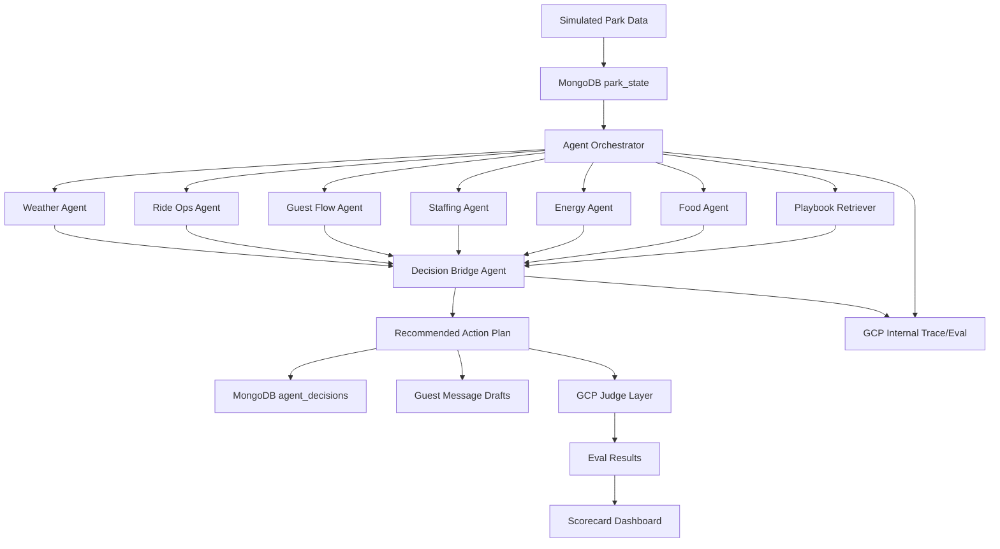

# ParkPulse Agent Architecture

ParkPulse AI is a multi-agent operations copilot for amusement parks.

## Primary Loop

## Lifecycle Agent Groups

ParkPulse uses three versions of the agent group across the event lifecycle:

| Group | Purpose | Primary work | Output |
| --- | --- | --- | --- |
| Pre-event agent group | Simulate policy impact and reduce preventable risk before the event starts or before a disruption peaks. | Event planning, traffic-flow forecast, placement review, staffing/equipment pre-stage, safety and finance stress tests. | Policy impact simulation, prevention checklist, risk forecast, and pre-approved action candidates. |
| During-event agent group | Supervise live conditions and react safely when signals arrive. | Runtime signal reading, specialist disagreement resolution, policy gates, operator approval flags, and REST action dispatch. | Supervised action plan, guest/worker/equipment payloads, and live response telemetry. |
| Post-event agent group | Analyze what happened, learn, and improve the next plan. | Outcome scoring, trace/eval review, logic audit, memory writeback, and plan revision. | Eval scorecard, MongoDB learning rule, revised thresholds, and a new plan version. |

The same specialist roles can appear in more than one group, but each group has a different operating question:

* Pre-event: What can be prevented before operators are forced into a reactive move?
* During-event: What changed right now, and what action can safely stabilize it?
* Post-event: Did the action work, what did we learn, and what should change next time?

## Demo Scenarios

### Scenario A: Ride Down

Dragon Coaster is down for 60 minutes. Nearby guests must be redistributed without overloading Indoor Ride B, Food Court 2, or staff.

### Scenario B: Staff Shortage

Callouts create a conflict between ride waits, food queues, protected breaks, and safety coverage.

### Scenario C: Food Demand Spike

Mobile-order backlog and low inventory require menu suppression, demand redirection, pickup-time updates, and staff movement.

## MongoDB Collections

| Collection | Purpose |
| --- | --- |
| `park_state` | Current ride, queue, weather, crowd, staff, food, and energy state. |
| `rides` | Ride metadata, capacity, indoor/outdoor status, staffing, safety constraints. |
| `staff_shifts` | Availability, training, fatigue, break windows. |
| `food_inventory` | Menu availability, kitchen load, restock signals, prep times. |
| `incidents` | Downtime, complaints, weather events, lost-child reports, maintenance warnings. |
| `agent_decisions` | Recommendations, evidence, tradeoffs, confidence, approval state. |
| `playbooks` | Vector-searchable procedures and response plans. |
| `guest_messages` | App notification drafts and reviewed outbound copy. |
| `eval_results` | GCP trace/eval scores and failure explanations. |

## GCP Trace/Eval Role

GCP trace/eval is the default observability and quality-control layer for the current demo. It should answer:

* Did the agent use actual source data?
* Did the agent avoid unsafe ride recommendations?
* Did it avoid overloading staff?
* Did it recommend inventory that exists?
* Did it create a new crowd bottleneck?
* Is the final plan specific enough to execute?
